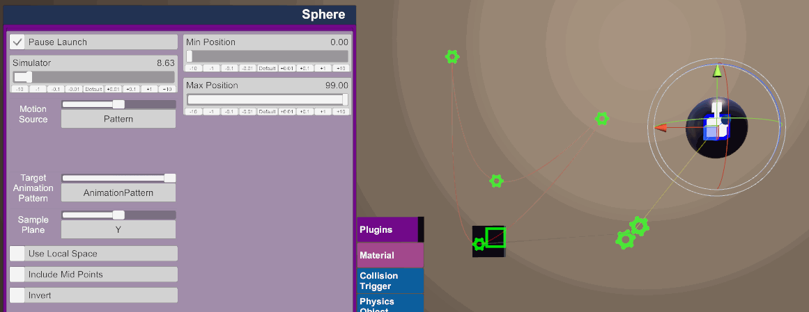
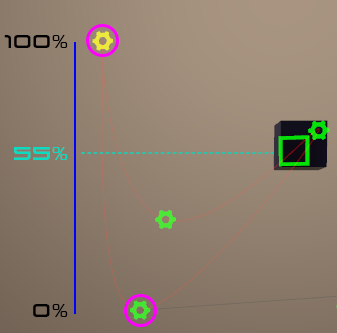
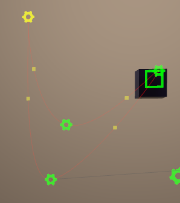

## AnimationPattern Mode

AnimationPattern mode works like oscillation mode but in reverse. Instead of an oscillation driving a motion and pattern, a target pattern is driving the motion directly.

It works by taking a look at the positions of all the steps in the pattern, it then works out which ones are the minimum and maximum positions relative to a plane (by default this is set to the Y axis).

> Sample range on the Y Axis:
>
> 

Mode Options:

- Min Position: The lowest position your device will be allowed to go.
- Max Position: The highest position your device will be allowed to go.
- Target Animation Pattern: This is how you define a pattern target.
- Sample Plane: This determines which world axis to use when determining the min/max ranges of your motion, the above example is using the Y axis.
- Use Local Space: If this is ticked, it will convert all the step positions into the local space of the AnimationPattern atom, this can be useful if you wish to rotate your whole motion without modifying your devices behaviour. (The sample plane will also be in local space, for example Y will be the Atoms "up").
- Include Mid Points: If this is ticked it will insert additional sample points half between each original step, if you have your plugin atom selected it will highlight these mid points on your pattern.
- Invert: This will invert your devices movements.

> Example of mid points turned on.
>
> 
