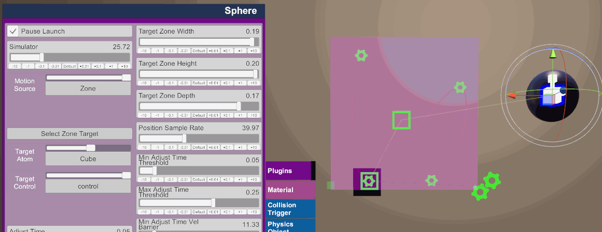
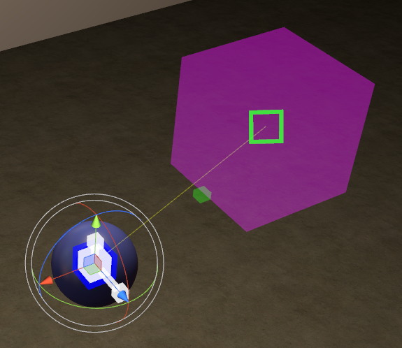
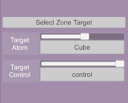
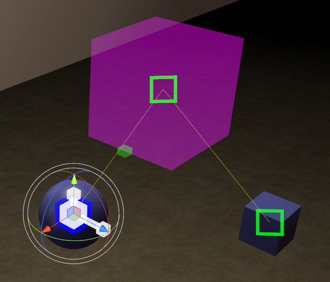
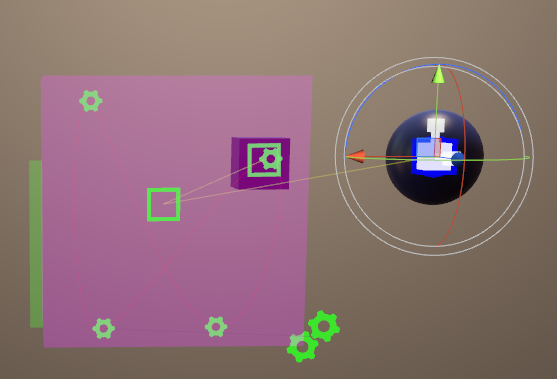

## Influence Zone Mode (Experimental)

This mode is the least accurate of the three modes, but it is the most adaptable.
In the other modes, the motions the device will perform are deterministic in the sense that it can pre-compute what needs to be done to match what's going to happen, in this mode that is not the case.

> *I don't suggest using this mode any more as the two other new modes are capable of achieving much better results. Only use it if your motions are going to be very unpredictable.*

In this mode you define an Influence Zone (A cube) and a target. It will sample the positions of the target when it moves around, any positions outside the cube are ignored.

When in Influence Zone Mode VAMLaunch uses a basic system that tries to "predict" what sort of motions to take
in order to match what's happening on screen. This system is far from perfect and
suffers from a slight delay but it seems to work fairly well in certain conditions.

One of the biggest challenges of getting the Launch to work well with VAM is the
fact that it doesn't like to have it's position updated very frequently as it
starts to jitter and not respond very well. Sending updates at a slower rate makes accuracy hard, because by the time you have
the information you need (velocity data from sampling multiple positions) you are
already too late and the device motion will not accurately match what happened.

> To get the best out of the system make sure you're creating motions that smoothly go up
and down in a fairly linear manner.
> Slower motions may cause some strange behavior and if your motions are too fast
then the device will not be able to keep up.

##### Setting Up The Zone

When you change to this mode, VAMLaunch will automatically create a new Atom called "LaunchZone", a yellow line will be drawn from your plugin atom to the zone to help you find it.

Next you will need to select a target for your zone:

When a target has been set, another yellow line will be drawn from the zone to your target.

Once all hooked up you need to move your influence zone to cover the area
where the motion will happen.

A green bar on the left side of the zone will give a visual representation of what the vertical position (0-100%) will be for your tracked object.

> *It is important to note that it tracks the local Y axis inside the cube, make
sure your cube is pointed upwards (the green arrow), or Y is aligned with your
path of motion.*

> You can set up the zone size using these sliders.
>
> 

Other Mode Options:

- Position Sample Rate: Your frame rate can greatly affect how good the prediction algorithm performs,
this slider allows you to control the rate at which the positions are sampled. In VR it is common in VAM to have a FPS of around 40,
therefore to attempt to keep the experience consistent for people who use your scene, this is by default set at 40.

- Min / Max Adjust Time Threshold: The system will monitor how long the motion
is going in a certain direction and then if the direction is held for a long
enough time it will decide it's a valid motion and tell the device to move.
The time threshold used is blended between these two values based on the current
average velocity in the system.

- Min / Max Adjust Time Vel Barrier: As mentioned above the time threshold is blended
based on average velocity, when the average velocity is slow then a longer time
threshold is used and when the average velocity is fast a shorter time threshold is used.
These two values define what velocity is considered "slow" and "fast".

- Launch Speed Multiplier: This will adjust the final speed output to the
device to allow you to finely tweak how the device is reacting to your designed motion.

- Adjust Time - This slider cannot be adjusted, it simply shows what the current calculate Time threshold is for valid movements.
