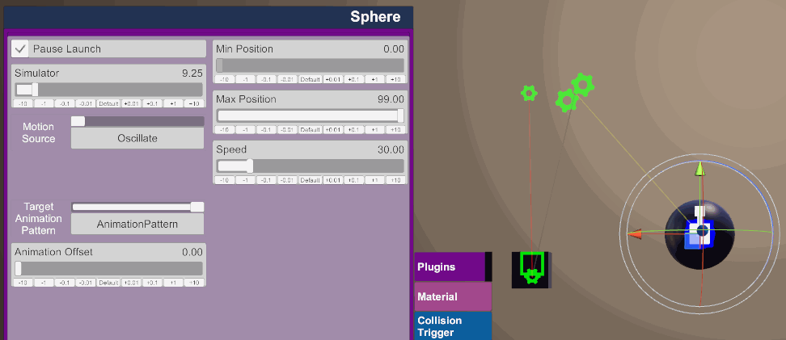

## Oscillate Mode

Oscillate mode simply tells the device to move up and down at a certain speed, what makes this mode even more powerful is the ability to set an optional target AnimationPattern; VAMLaunch will take over this pattern and automatically adjust it's play time and speed to match the oscillation.

Mode Options:
- Min Position: The lowest position your device will be allowed to go.
- Max Position: The highest position your device will be allowed to go.
- Speed: How fast the oscillating motion will go.
- Target Animation Pattern: This is how you define a pattern target.
- Animation Offset: If you find that your AnimationPattern is out of sync with the simulator you can adjust this slider to offset the animations play time (in normalized time), in most cases Animation offset should be set at either 0.0 or it's max value of 0.5 (fully inverted).
