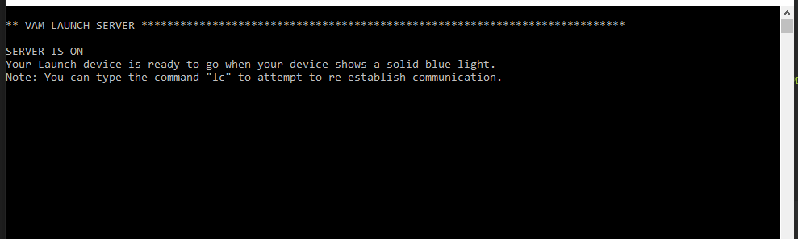
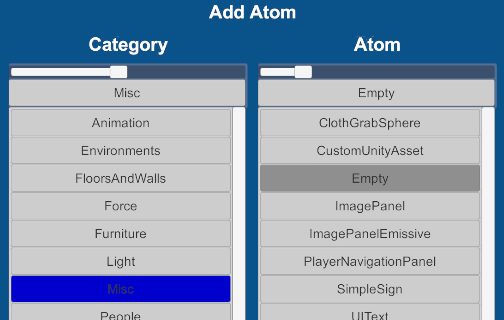
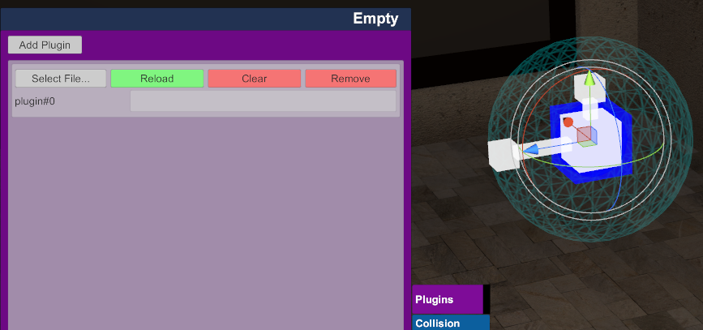
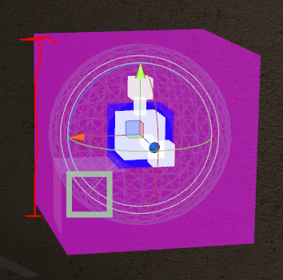
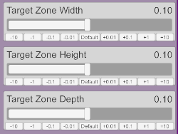
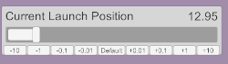
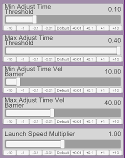
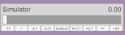

# VAM Launch
## VAM Plugin that adds support for Launch devices.

###### First off

VAM Launch uses code from the [ScriptPlayer](https://github.com/FredTungsten/ScriptPlayer)
project in order to achieve bluetooth communication with the Launch device.
> The ScriptPlayer code is licenced under the BSD 3-Clause License

> Copyright (c) 2017, Fred Tungsten

> All rights reserved.

I have tried to respect the license by placing headers in all the source code taken from that
project, and I want to give a large thanks to the developers involved in
ScriptPlayer as this would not have been possible without their hard work.

Full license information for ScriptPlayer can be found [here](https://raw.githubusercontent.com/FredTungsten/ScriptPlayer/master/LICENSE)

For any code written by myself for VAM Launch specifically, I will not hold any license to
it and you may do anything you wish with it. In fact I hope people do take this
code and improve on it.

###### Features

- Handles bluetooth connection to Launch devices
- An experimental system that analyses the movement of a target atom and predicts
a motion to perform in order to get around the hardware limitations of the Launch device.
- In game menu to adjust prediction settings and sample zone.

##### Prediction System

One of the biggest challenges of getting the Launch to work well with VAM is the
fact that it doesn't like to have it's position updated very frequently as it
starts to jitter and not respond very well.

When you send a message to the device you have to define a position (which has
a range of 0-99) and a speed (which also has a range of 0-99).

Sending updates at a slower rate makes accuracy hard, because by the time you have
the information you need (velocity data from sampling multiple positions) you are
already too late and the device motion will not accurately match what happened.

VAM Launch implements a basic system that tries to "predict" what sort of motions to take
in order to match what's happening on screen. This system is far from perfect and
suffers from a slight delay but it seems to work fairly well in certain conditions.

> To get the best out of the system make sure you're creating motions that smoothly go up
and down in a fairly linear manner.
> Slower motions may cause some strange behavior and if your motions are too fast
then the device will not be able to keep up.

###### VAMLaunch Plugin and LaunchServer

There are two pieces to VAM Launch, the plugin for VAM and the LaunchServer
which directly controls the device.

Because VAM has security rules in place to prevent certain libraries running
it was necessary to create an external application that performs the bluetooth
connection to the device.  

The VAM Plugin communicates to the LaunchServer through UDP.

###### LaunchServer Installation

LaunchServer.exe can be run from anywhere and needs to be active during your
whole VAM session.
It is highly recommended that you turn on your Launch device before running the
server.
You will know when your device is connected because your bluetooth light will
go a solid blue.

If you wish to reattempt the connection, you can type the cmd: "lc".

###### Plugin Usage

First off you need to place the "VAMLaunch" folder in
YOUR_VAM_LOCATION/Saves/Scripts

Next in your scene you need to create an empty atom

You then need to select the atom and go to the plugin section

You then need to select the ADD_ME.cslist file to run the plugin.

If successful you should see the plugin appear in the list and your empty atom
will now have a pink cube around it.

This pink cube is the "Influence Zone", the idea is that you specify another
object to track and the system will look at where the object is inside the cube.
If the object is at the top of the cube it means the Launch device will be fully
up and if at the bottom of the cube the device will be fully down.

> **It is important to note that it tracks the local Y axis inside the cube, make
sure your cube is pointed upwards (the green arrow), or Y is aligned with your
path of motion.**

To set the target object and adjust the zone size, we need to enter the plugin
menu.

##### Options Menu

To open the menu go to the plugin section on your empty atom and press
"Open Custom UI"

First off make sure you have a target object (In this case we will use a cube),
either use the "Select VAM Launch Target" button or select an atom and controls
from the list.

> A yellow line will be drawn to your current target object.

Once all hooked up you need to move your influence zone to cover the area
where the motion will happen.

In this example the cube will move up and down, we have placed the zone to cover
this movement area.

To adjust the zone size use the three sliders in the top right.

To help with tuning your setup correctly you can take a look at the
"Current Launch Position" slider; this represents how your target
object will translate into a vertical position for the Launch device.

Once you're happy with your setup and the launch position slider is responding
well the last thing to do is to un-pause the messages being sent to the Launch device.

Your launch device should now be responding to any motion.

##### Advanced settings

These settings control how the system makes it's predictions:

- Min / Max Adjust Time Threshold: The system will monitor how long the motion
is going in a certain direction and then if the direction is held for a long
enough time it will decide it's a valid motion and tell the device to move.
The time threshold used is blended between these two values based on the current
average velocity in the system.

- Min / Max Adjust Time Vel Barrier: As mentioned above the time threshold is blended
based on average velocity, when the average velocity is slow then a longer time
threshold is used and when the average velocity is fast a shorter time threshold is used.
These two values define what velocity is considered "slow" and "fast".

- Launch Speed Multiplier - This will adjust the final speed output to the
device to allow you to finely tweak how the device is reacting to your designed motion.

##### For Modders

For anyone wishing to try to improve upon my system, I have added one last thing
to the plugin menu:

The plugin contains a simple simulator for the Launch device, it will try to mimic
what the device would do based on the messages sent to it. This can be quite
useful for testing out different solutions for producing clean motions without having
to deal with the real device all the time (but of course you should definitely test it
on the final thing to confirm!)
